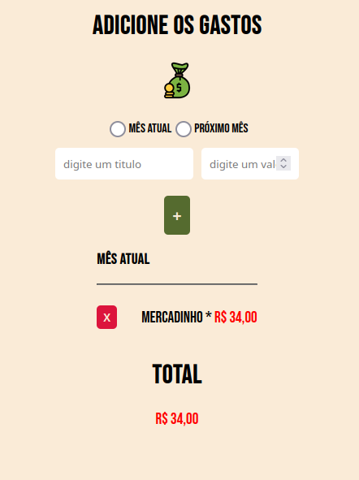

# Gastos Gerais

### ✨ Sobre
Web app para anotar valores que tem a pagar.

https://gastosgerais.netlify.app/

## 🔨 Ferramentas
- React {useContext, useReducer}
- LocalStorage
- PWA* {em aplicação}

---
## 🥰 Preview

## ❤️ Agradecimento
Para minha namorada Andressa que precisava de algo assim então tive a ideia de produzir um programinha para tal tarefa.
